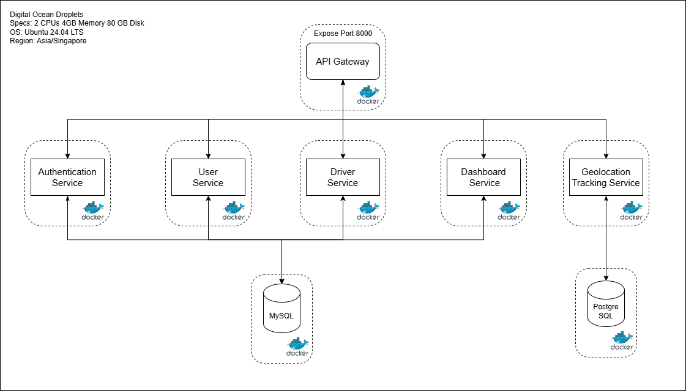

# Microservices Architecture

## 🏗 Tech Stack

This microservices application is built using the following technologies:

- 🏎 **Golang** - High-performance microservices
- ⚡ **Fiber** - Fast web framework for Go
- 🐬 **MySQL** - Relational database
- 🐘 **PostgreSQL (Postgis)** - PostgreSQL extension for spatial data
- 🔀 **Kong Gateway** - API Gateway
- 🐳 **Docker** - Containerized microservices
- 🔄 **GitHub Actions** - CI/CD pipeline